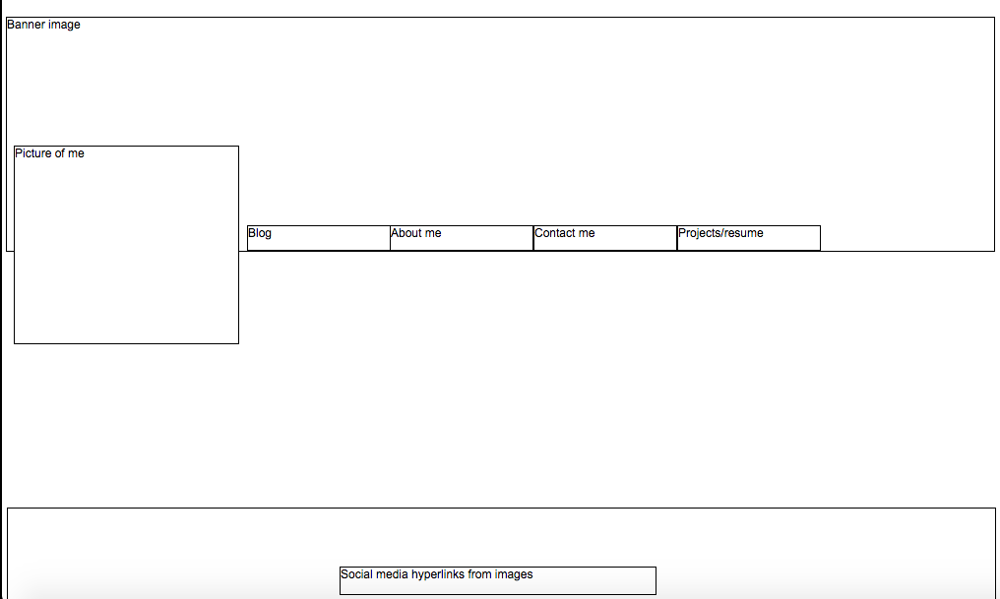

1. A wireframe is a detailed outline of how you want you website to look. It involves drawing boxes to represent how certain elements you page will look.

2. Wireframing allows you to get a blueprint of your website. Not wireframing is like telling construction workers to make a building without any building plans. The wireframe gives developers and idea as to how the final product should look.

3. The tool I used was a little cumbersome to deal with, but doing it gave me a nice visual representation to go off of. It's great having an actual picture to look at and see what you need to do. Overall, it was kinda fun to do. I would be interested to see how other wireframed their websites and where they got their ideas from.

4. I'm usually the type of person that needs to change an idea constantly until it's just right. I actually ended up sticking with my original idea. Kinda shocking (lol).

5. It took me a while to find a web tool to use. Initially, I took to the internet to find one before reading the upcoming instructions. I ended up using website wireframe, but I was curious to see if the adobe suite programs lived up to the price they charge for them. It seems like a lot of people use them, and I wanted to learn a little more about them. I went on the adobe website and watched a view youtube videos about some of the programs.

6. I liked the idea of building a wireframe for my site, but the actual action of doing it was a little wonky. It took me a few attempts to work with the program, but it ended up being just fine.

