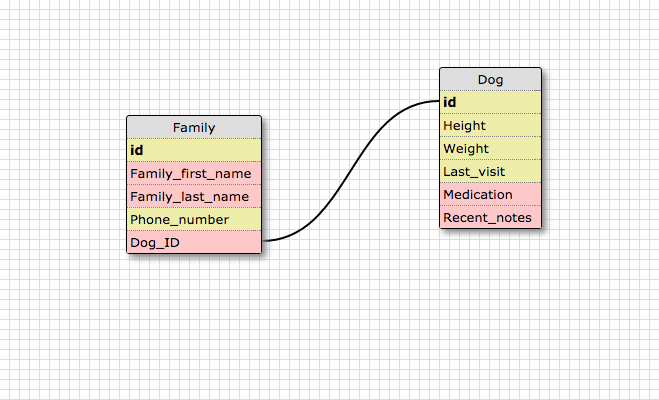
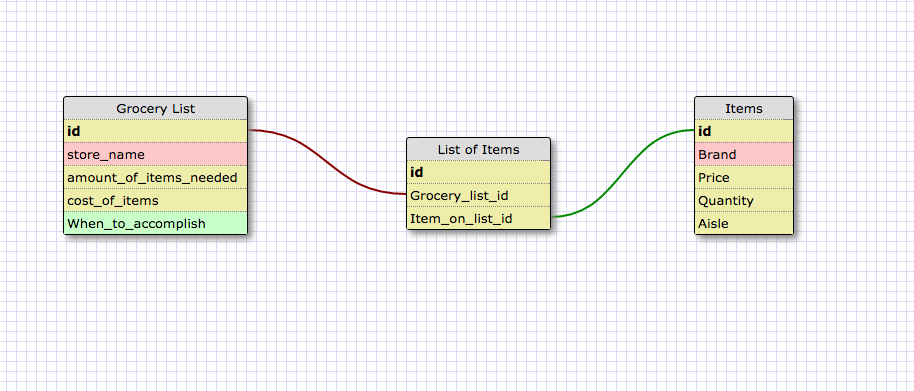

The reason this relationship is one to one is because a dog might not have visited the vet office before. The office might have the contact information for the family, but they might not have specific data about the dog like hight,weight or medication.

A one-to-one database is required when one table of data could be paired with another. For instance (my one-to-one vet example) the vet might have information on the family, but the dog might not have been to the vet for a checkup. The second table isn't required, but it can be paired with the first table.

Generally speaking, you would use a one-to-one data scheme when the secondary table can be paired with the first table. I almost view it like an onion. The first table might be the outer layer, but the second layer could be more specific data about the first data set.

A many-to-many can be used when you have multiple data tables that relate back to each other. I view them as lists that continually get more specific. The grocery list schema takes an initial list, which is very general. It goes through a join table and then it shows more specific data about the list.

I think I'll go back to the onion example.  You could use many-to-many when you need to get continually more specific. If you were amazon, you could gather information into an table about an order made by a customer, put it through a join table, and then give more specific data about the purchase.

When I look at these data schemes, they make a lot of sense. It is easy to see the flow of the data and interpret it. I think just making one on my own was a challenge. It's easy to read, but not so easy to write.